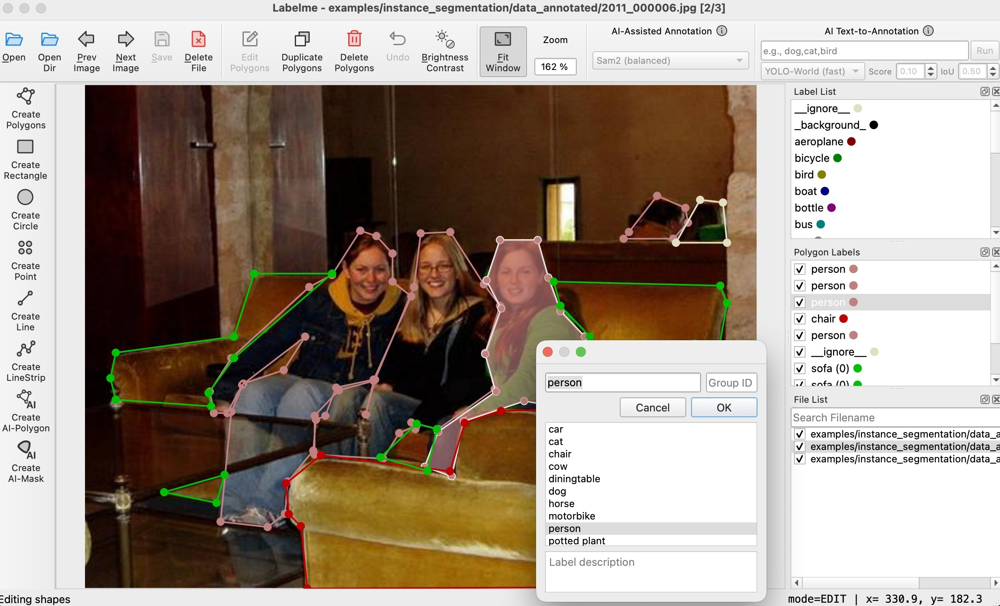
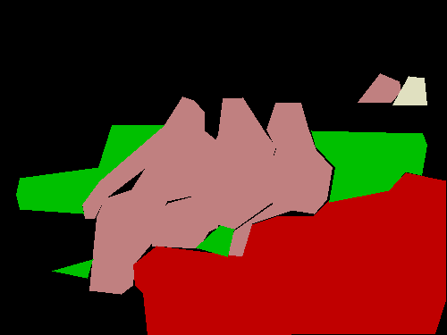
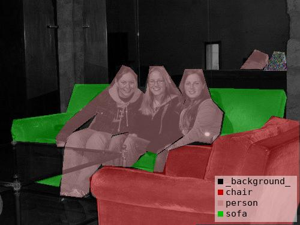
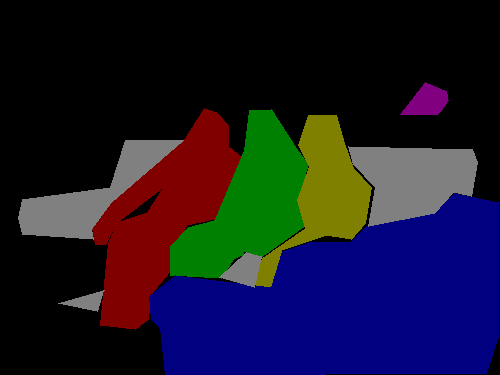
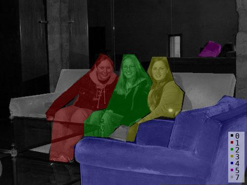
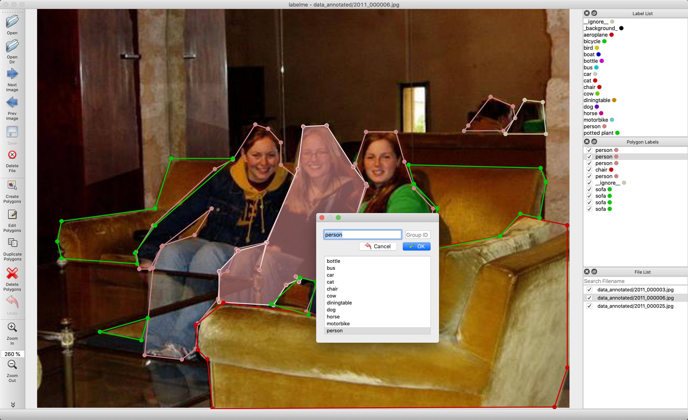
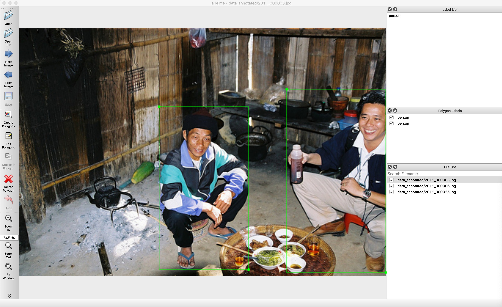
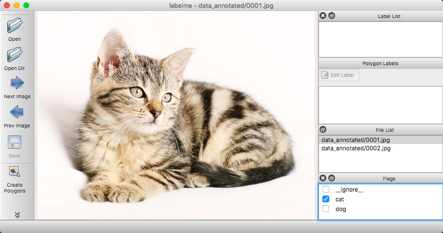

<h1 align="center">
  <br/>labelme
</h1>

<h4 align="center">
  Image Polygonal Annotation with Python
</h4>

<div align="center">
  <a href="https://pypi.python.org/pypi/labelme"></a>
  <a href="https://github.com/wkentaro/labelme/actions"></a>
  <a href="https://discord.com/invite/uAjxGcJm83"></a>
</div>

<br/>

<div align="center">
  
</div>

## Description

Labelme is a graphical image annotation tool inspired by <http://labelme.csail.mit.edu>.  
It is written in Python and uses Qt for its graphical interface.

## ✨ Key Features

- **Multiple annotation types**: polygon, rectangle, circle, line, and point
- **Image classification**: Flag-based annotation for classification tasks
- **Video annotation**: Frame-by-frame annotation support
- **AI-assisted annotation**: Point-to-polygon/mask with SAM/EfficientSAM, text-to-bbox with YOLO-World
- **Advanced polygon editing**: 
  - Add multiple points to edges (`Ctrl+M`)
  - Merge polygons with geometric union (`Ctrl+Shift+M`)
- **Dataset export**: VOC and COCO format support
- **Multilingual**: 15+ languages supported
- **Customizable**: Predefined labels, auto-saving, label validation, and more

<details>
<summary><b>View Screenshots</b></summary>

    

*Instance segmentation with VOC dataset format*

  

*Semantic segmentation, bounding box detection, and classification*

</details>

## 🚀 Installation

### Option 1: pip (Recommended)

```bash
pip install labelme

# Or install latest from GitHub:
pip install git+https://github.com/wkentaro/labelme.git
```

**Note**: For detailed installation instructions, see [labelme.io/docs/install-labelme-terminal](https://www.labelme.io/docs/install-labelme-terminal)

### Option 2: Standalone Executable

Download the standalone app (no Python required) from [labelme.io/docs/install-labelme-app](https://www.labelme.io/docs/install-labelme-app).

### Option 3: Package Manager

Some Linux distributions provide labelme via package managers:

[](https://repology.org/project/labelme/versions)

## 📖 Usage

### Basic Usage

```bash
labelme                                # Launch GUI
labelme image.jpg                      # Annotate specific image
labelme image.jpg -O output.json       # Save and close automatically
labelme image_folder/                  # Annotate all images in folder
labelme --labels labels.txt            # Use predefined labels
```

### Quick Start

1. **Launch**: Run `labelme` to open the GUI
2. **Open image**: File → Open or `Ctrl+O`
3. **Create annotation**: 
   - Polygon: `Ctrl+N`, then click to draw points
   - Rectangle: `Ctrl+R`, then drag
   - AI-assisted: Use toolbar icons for SAM/YOLO-World
4. **Edit annotations**: 
   - Edit mode: `Ctrl+J`
   - Add points to edge: Hover over edge, press `Ctrl+M`
   - Merge polygons: Select multiple (`Ctrl+Click`), press `Ctrl+Shift+M`
5. **Save**: `Ctrl+S` to save as JSON

### Advanced Features

| Feature | Shortcut | Description |
|---------|----------|-------------|
| Add Multiple Points | `Ctrl+M` | Add N evenly-spaced points to polygon edge |
| Merge Polygons | `Ctrl+Shift+M` | Combine multiple polygons using geometric union |
| Remove Point | `Backspace` | Remove selected vertex from polygon |
| Edit Label | `Ctrl+E` | Change shape label |
| Duplicate | `Ctrl+D` | Duplicate selected shape |

For complete documentation, see [QUICK_START.md](QUICK_START.md).

## 📦 Examples

The `examples/` directory contains complete workflows for:

- [Tutorial](examples/tutorial) - Basic polygon annotation
- [Classification](examples/classification) - Image classification with flags
- [Bounding Box Detection](examples/bbox_detection) - Object detection
- [Semantic Segmentation](examples/semantic_segmentation) - Pixel-wise segmentation
- [Instance Segmentation](examples/instance_segmentation) - Instance-aware segmentation
- [Video Annotation](examples/video_annotation) - Frame-by-frame video labeling

Each example includes sample data, scripts, and detailed README files.

## 🔧 Configuration

Labelme creates a config file at `~/.labelmerc` on first run. Customize:

```yaml
# Auto-save annotations
auto_save: true

# Predefined labels
labels:
  - person
  - car
  - bicycle

# Custom shortcuts
shortcuts:
  add_multiple_points: Ctrl+M
  merge_polygons: Ctrl+Shift+M
  
# Default AI model
ai:
  default: 'Sam2 (balanced)'
```

See [`default_config.yaml`](labelme/config/default_config.yaml) for all options.

## 🆕 What's New in This Fork

This version includes enhanced polygon editing capabilities:

### 1. **Multiple Point Addition** (`Ctrl+M`)
Add multiple evenly-spaced points to polygon edges for detailed boundary refinement.

**Usage**: Hover over edge → Press `Ctrl+M` → Enter number of points → Points distributed evenly

### 2. **Polygon Merge** (`Ctrl+Shift+M`)
Merge multiple polygons using geometric union operations with intelligent handling of disconnected regions.

**Usage**: Select polygons (Ctrl+Click) → Press `Ctrl+Shift+M` → Polygons merged with same label

See [FEATURES_SUMMARY.md](FEATURES_SUMMARY.md) for detailed documentation.

## 🛠️ Development

```bash
# Clone repository
git clone https://github.com/wkentaro/labelme.git
cd labelme

# Install in development mode
pip install -e .

# Run tests
pytest

# Run with specific language
LANG=ja_JP.UTF-8 labelme
```

## 🤝 Contributing

Contributions are welcome! Please:

1. Fork the repository
2. Create a feature branch (`git checkout -b feature/amazing-feature`)
3. Commit your changes (`git commit -m 'Add amazing feature'`)
4. Push to the branch (`git push origin feature/amazing-feature`)
5. Open a Pull Request

## 📄 License

This project is licensed under the [GPLv3 License](LICENSE).

## 🙏 Acknowledgements

- Original labelme: <http://labelme.csail.mit.edu>
- This repo is a fork of [mpitid/pylabelme](https://github.com/mpitid/pylabelme)
- AI features powered by [OSAM](https://github.com/wkentaro/osam)

## 📚 Citation

If you use this software in your research, please cite:

```bibtex
@misc{labelme2024,
  author = {Kentaro Wada and Contributors},
  title = {labelme: Image Polygonal Annotation with Python},
  year = {2024},
  publisher = {GitHub},
  howpublished = {\url{https://github.com/wkentaro/labelme}},
}
```

See [CITATION.cff](CITATION.cff) for complete citation information.

---

<div align="center">
  <b>⭐ Star this repo if you find it useful!</b>
</div>
